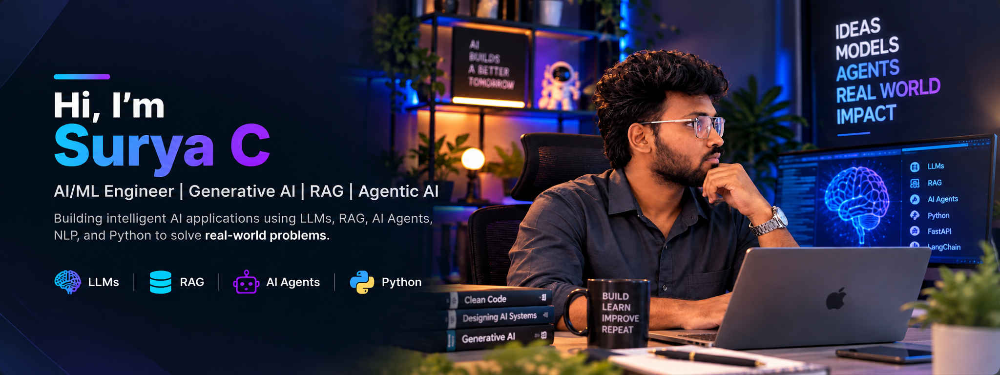

  

 

## 🧠 ABOUT ME

I build <strong>production-oriented AI applications</strong> using
LLMs, RAG, Agentic AI, and Machine Learning.

My focus is turning AI concepts into practical systems that can
<strong>retrieve, reason, automate, and solve real-world problems.</strong>

---

## ⚡ WHAT I BUILD

<table>
<tr>

<td width="25%" align="center">

### 🤖

<strong>LLM Applications</strong>

Building applications powered by Large Language Models.

</td>

<td width="25%" align="center">

### 🔎

<strong>RAG Systems</strong>

Building grounded AI systems using retrieval and vector databases.

</td>

<td width="25%" align="center">

### ⚡

<strong>AI Agents</strong>

Building intelligent workflows with tools, reasoning, and automation.

</td>

<td width="25%" align="center">

### 👁️

<strong>Multimodal AI</strong>

Working with text, images, documents, and video.

</td>

</tr>
</table>

---

# 🚀 FEATURED PROJECTS

<table>

<tr>

<td width="50%" valign="top">

## 🔐 Cybersecurity RAG Assistant

A document-grounded AI assistant for cybersecurity knowledge retrieval.

**Stack**

`Python` `RAG` `BGE` `Qdrant` `Groq`

**Highlights**

- 📚 NIST security documents
- 🔎 Semantic retrieval
- 🧠 LLM-based answer generation
- 📊 7K+ indexed vectors

 

</td>

<td width="50%" valign="top">

## 📊 Project Health Reporting Agent

AI agent that analyzes project information and generates project health reports.

**Stack**

`Python` `RAG` `AI Agents` `LLMs`

**Highlights**

- 🔴 Red / 🟠 Amber / 🟢 Green status
- 📅 Schedule analysis
- 💰 Budget signals
- 🚧 Blocker detection
- 💬 Plain-English reasoning

 

</td>

</tr>

<tr>

<td width="50%" valign="top">

## 🎤 AI Interview Coach

Resume-driven AI assistant for technical interview preparation.

**Stack**

`Python` `LLM` `RAG` `Streamlit`

**Highlights**

- 📄 Resume understanding
- 💬 AI-generated interview questions
- 🧠 Context-aware responses
- 📈 Interview feedback

 

</td>

<td width="50%" valign="top">

## 🎥 YouTube Learning Assistant

AI-powered learning system that transforms video content into structured knowledge.

**Stack**

`Python` `Multimodal AI` `RAG` `LLMs`

**Highlights**

- 🎬 Video processing
- 📝 Automatic notes
- ❓ Quiz generation
- 🧠 Knowledge retrieval
- 🔎 Transcript + visual understanding

 

</td>

</tr>

</table>

---

# 🛠️ TECH STACK

### 🤖 Generative AI

  

### 💻 Development

  

### 🗄️ Data & Vector Search

---

# 🎯 CURRENT FOCUS

`Production RAG`
→
`Agentic AI`
→
`LLMOps`
→
`Evaluation`
→
`Scalable AI`

---

# 📊 GITHUB

Explore my repositories, AI projects, experiments, and development work.

 

---

# 📫 CONNECT

&nbsp;

&nbsp;

